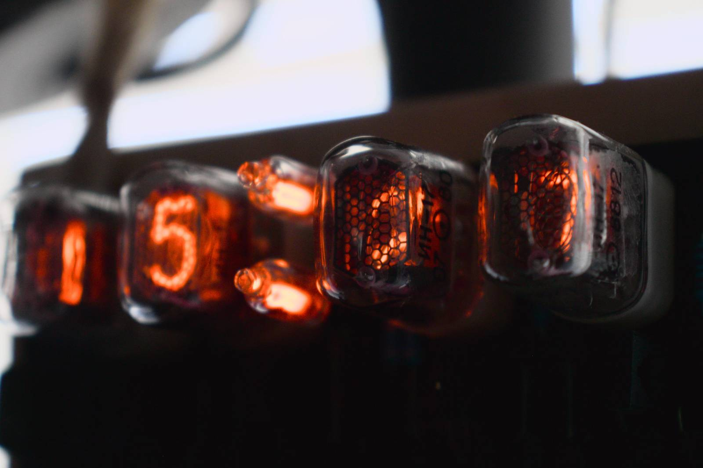
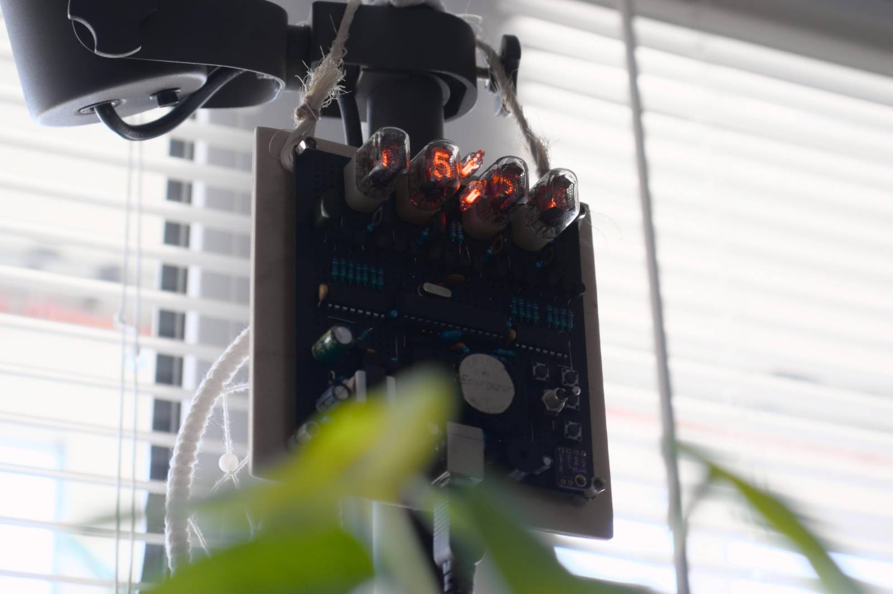

# ✨ IN17 Clock

## IN17 Nixie tube clock with internal DC-DC converter, random melody alarm and temperature/humidity sensor

----------

## Easy-to-find parts

The project does not use components that are difficult to buy (except for nixie tubes themselves). Even the DC-DC HV converter is driven by the Arduino itself using BJTs-based driver without third-party MOSFET drivers, and the HV transformer is wound on an old CFL choke.

Required parts:

- 4x IN-17 (ИН-17) Nixie tubes (or any other that you can find)
- 2x Neon bulbs for separator (from an old power switches)
- DS3231 RTC module
- DHT31 temperature + humidity sensor (can be replaced with different one but requires modifying code)
- 2x 74HC595 shift registers
- 1x ATmega328P (from an old Arduino UNO)
- 16MHz crystal oscillator
- Passive buzzer
- Old CFL for choke
- Any 20-90V MOSFET (for driving HV transformer). Mine is P75N02 (25V 75A)
- 19x (10 + 4 + 4 + 1) 13003 BJTs from an old CFLs (for multiplexing nixies and separator)
- A bunch of capacitors, resistors, buttons and common BJTs (BC547, BC557, etc.)

----------

## 🏗️ Getting started

> 🚧 README in progress...
